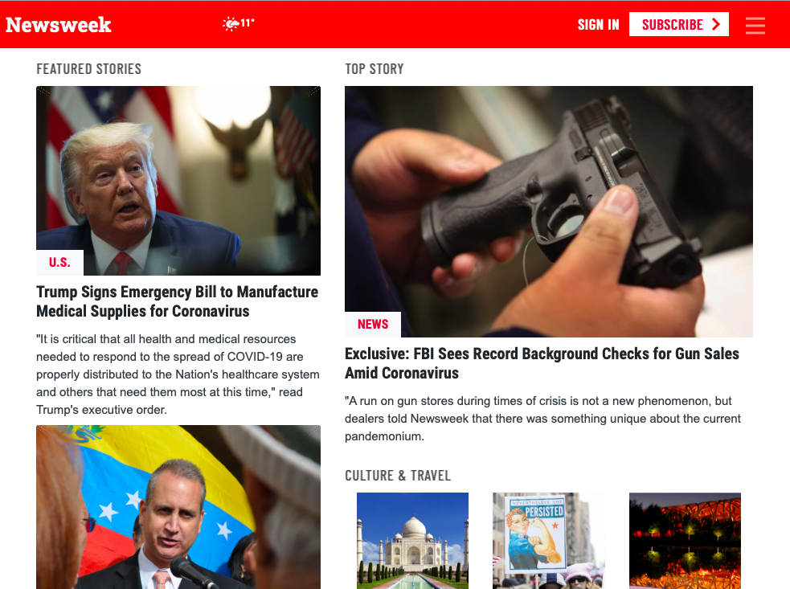

# Newsweek
This project demonstrates the use of Twitter’s Bootstrap framework by building a mock-up of Newsweek site that actually uses it

> The structure of the index page (index.html) is based on the Newsweek.com main page
> The page shows a variety of sections of links to articles and shows them responding to small, medium and large screens
- Top Story
- Featured Stories
- Opinion
- Debate
- More Stories
- Culture and Travel
- Latest News
- In The Magazine
- Editor's Pick
- Series of Slide Shows

>These sections are rearranged depending on the size of the screen

## To achive this, Bootstrap breakpoints and media queries have been used

The structure of the index page is based on the Newsweek.com main page in small medium and large screens

## Built With

- HTML,
- CSS,
- Bootstrap
- Google Fonts

## Live Demo

[Live Demo Link](https://rawcdn.githack.com/ioanniskousis/Newsweek/8c64fe2811ddae3867dcf3e9914f39f008fbde9f/index.html)

## Getting Started

To get a local copy up and running follow these simple example steps.

### Prerequisites

#### You should have installed git on your local machine and a text editor preferably VS Code.

### Setup

#### Clone the repository into your local machine.

## 👤 Author
## Ioannis Kousis

- Github: [@ioanniskousis](https://github.com/ioanniskousis)
- Twitter: [@ioanniskousis](https://twitter.com/ioanniskousis)
- Linkedin: [Ioannis Kousis](https://www.linkedin.com/in/ioannis-kousis-9a5051b4/)

## 🤝 Contributing

Contributions, issues and feature requests are welcome!

Feel free to check the [issues page](issues/).

## Show your support

Give a ⭐️ if you like this project!

## Acknowledgments

- Appreciation to my coding Partner John Ioannis Kousis and my mentor

## 📝 License

This project is [MIT](lic.url) licensed.
